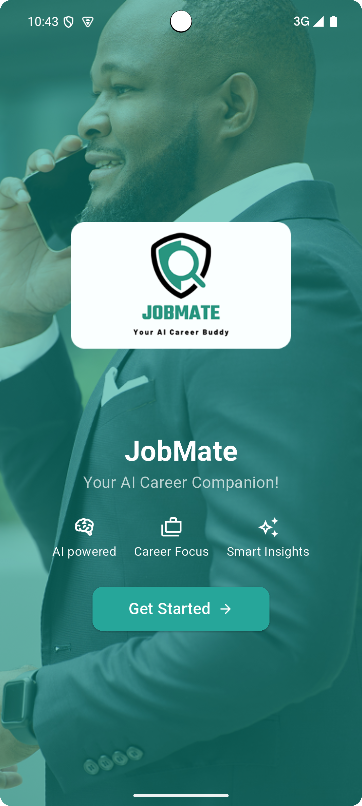
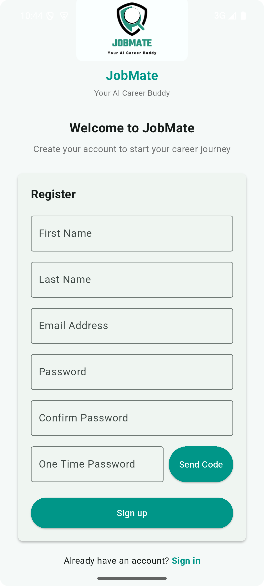
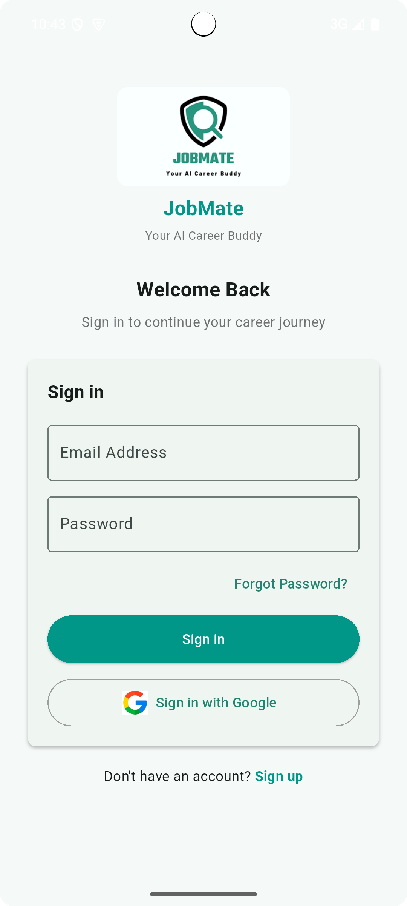
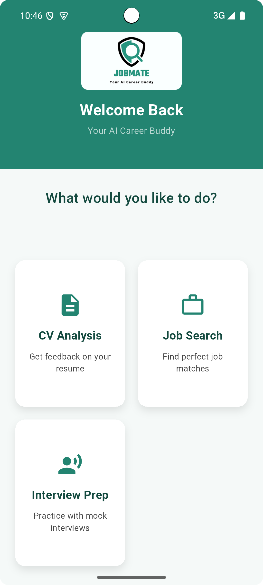
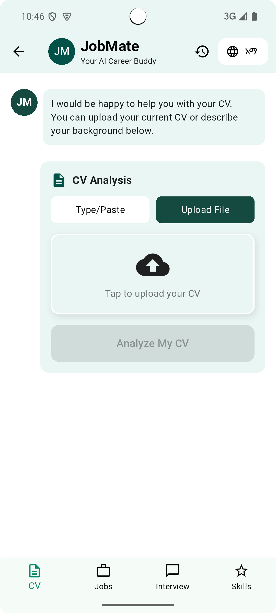
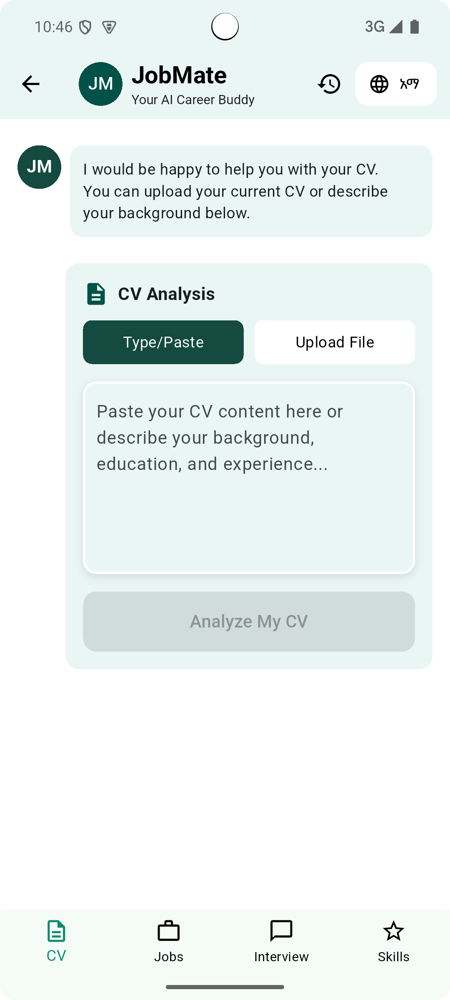
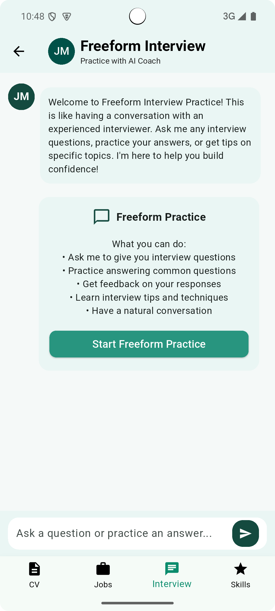
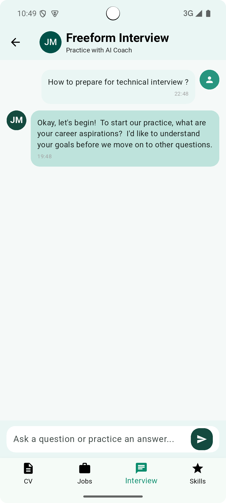
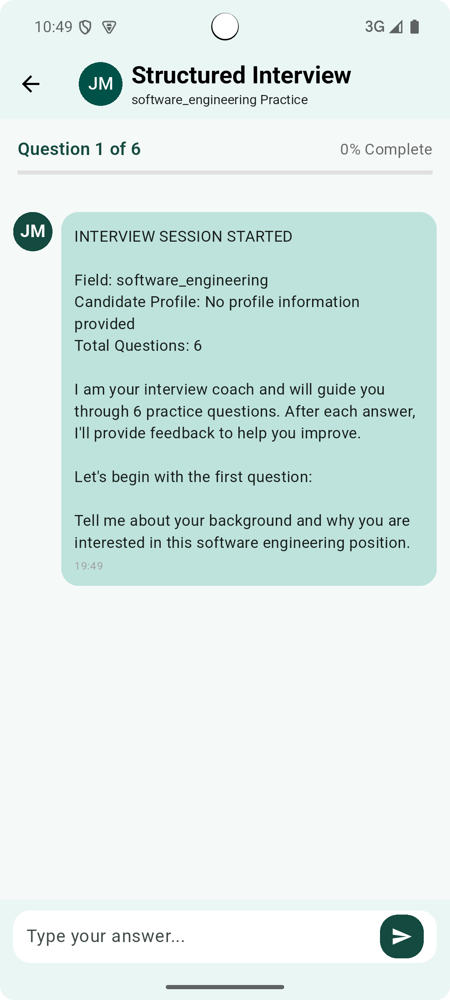
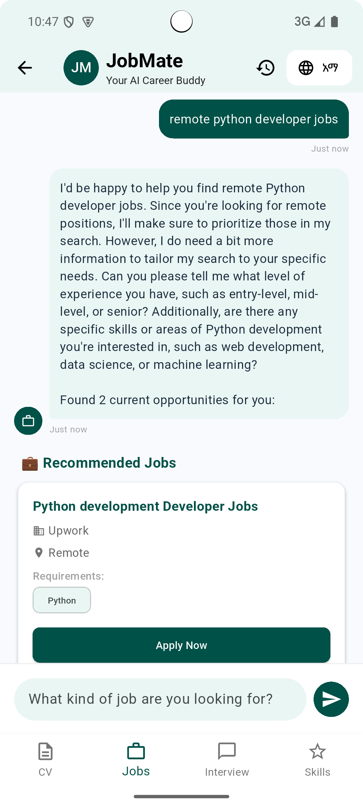

# JobMate: AI-Powered Career Buddy for Africa

JobMate is an AI-powered career buddy built to tackle youth unemployment in Africa. By combining CV analysis, job matching, and interview prep into one platform, JobMate helps young Africans bridge skill gaps and connect to global opportunities.

It’s available as both a web app (Next.js) and a mobile app (Flutter).

---

## 🚀 Problem

Youth unemployment in Africa is at crisis levels, especially in urban areas. Existing job boards don’t:

- Personalize searches for African job seekers  
- Provide real-time CV feedback  
- Offer interview coaching tuned to local cultural/remote work contexts  
- Suggest actionable skill-building paths  

---

## 💡 Solution

JobMate uses **Gemini Flash 1.5 AI** with a **Go backend** to act as a career coach:

- 📄 Analyze CVs and suggest improvements  
- 🔍 Match jobs from global & Africa-friendly platforms  
- 🎤 Coach interviews with mock Q&A + instant feedback  
- 📈 Suggest online free and affordable courses to fill skill gaps  

All in a **chat-first experience** that works in English and Amharic.  

---

## ✨ Key Features

- **CV Upload & Smart Feedback** – Upload via text, PDF, or image → AI suggests improvements.  
- **Job Matching & Search** – Personalized listings ranked by skill fit.  
- **Interview Prep Mode** – Mock sessions with AI feedback.  
- **Conversational or Written Use** – Voice/text chat with multilingual support.  
- **Skillset Boost** – AI-generated course suggestions.  

---
## 📱 Application Screenshots

### 🔐 Authentication Flow (Mobile App)

| Welcome Screen | Sign Up | Login | Dashboard |
| -------------- | -------------- | -------------- | --------- |
|  |  |  |  |

### 📄 CV Management Features (Mobile App)

| CV Upload Interface | CV Analysis Results |
| ------------------- | ------------------- |
|  |  |

### 🎤 Interview Preparation Suite (Mobile App)

| Free-form Interview | Free-form Interview Chat | Structured Interview |
| ------------------- | -------------- | -------------------- | 
|  |  |  |

### 🔍 Job Search & AI Features (Mobile App)

| Job Search Interface |
| ------------ |
|  |

## ⚙️ Tech Stack

- **Backend**: Go (Golang) + Gemini Flash 1.5 (for AI)  
- **Database**: MongoDB  
- **Web Frontend**: Next.js  
- **Mobile Frontend**: Flutter  

---

## 📥 Getting Started

### Backend (Go + MongoDB)

```bash
# Clone repo
git clone https://github.com/A2SV/g6-jobmate
cd jobmate/backend

# Install dependencies
go mod tidy

# Run service
go run main.go
```

---

## 🤝 Contributing

- Fork the repo  
- Create a branch (`git checkout -b feature/new-feature`)  
- Commit (`git commit -m "Add new feature"`)  
- Push (`git push origin feature/new-feature`)  
- Open a PR  

---

## 👥 Team

- **Backend & AI**: Go + Gemini Flash 1.5 engineers  
- **Web Frontend**: Next.js developers  
- **Mobile Frontend**: Flutter developers  
- **Community Testers**: A2SV students & Addis Ababa graduates

## 🌍 Vision

JobMate is more than a job board—it’s a career empowerment platform built for Africa. By connecting African youth to global opportunities, we aim to reduce unemployment and unlock talent across the continent.
